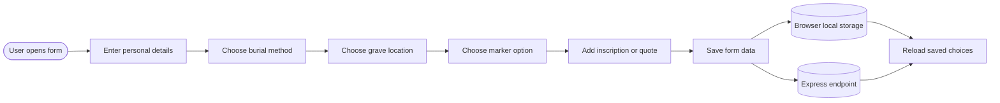
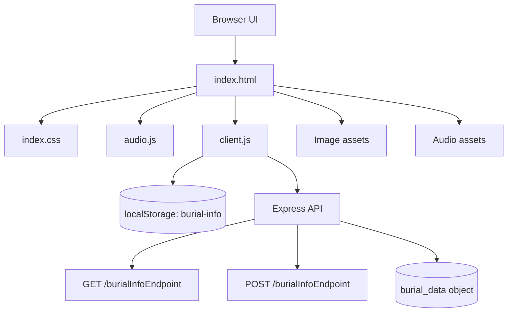
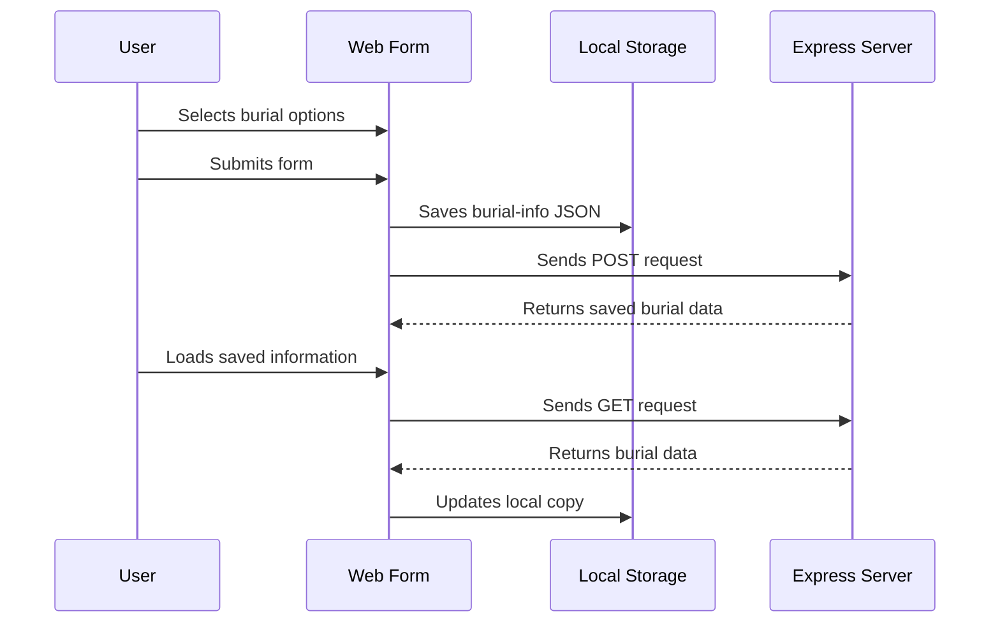
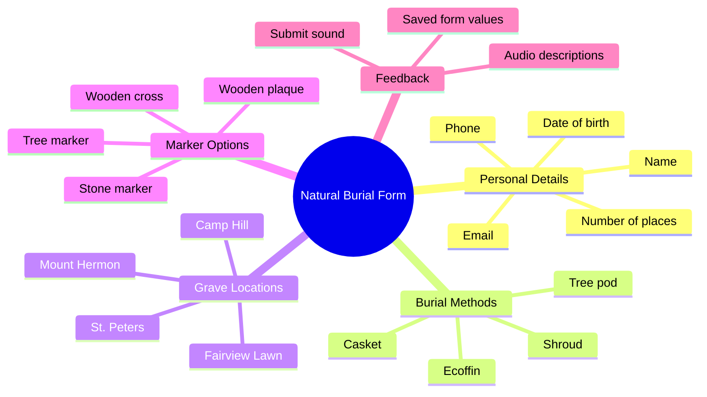

# CSCI-2356 Natural Burial Project

An interactive web form for exploring natural burial options, collecting user preferences, playing related audio descriptions, and saving burial information through browser storage and an Express endpoint.


## At a Glance

| Area | Details |
| --- | --- |
| Project | Natural burial preference form |
| Course | CSCI-2356 |
| Frontend | HTML, CSS, JavaScript, Tailwind CSS CDN, jQuery |
| Backend | Node.js and Express |
| Data | Browser local storage and server GET/POST endpoints |
| Media | Image cards and audio playback for burial choices |

## Experience Flow



## Application Architecture



## Data Lifecycle



## Feature Map



## Team Members

- Aakarshan Khosla
- Aarav Sen Mehta
- Bhabin Chudal
- Sadikshya Oli

## Folder Structure

```text
CSCI-2356/
|-- INSTRUCTIONS.MD
|-- README.md
`-- Natural Burial/
    |-- templates/
    |   `-- index.html
    `-- static/
        |-- audio/
        |-- css/
        |   `-- index.css
        |-- images/
        `-- javascript/
            |-- audio.js
            |-- jquery-3.7.1.js
            |-- tailwind.config.js
            `-- server/
                |-- client.js
                `-- index.js
```

## Running the Project

### Option 1: Open the Static Page

Open this file directly in a browser:

```text
Natural Burial/templates/index.html
```

This is useful for reviewing the layout, images, audio buttons, and local-storage behavior.

### Option 2: Run the Express Server

The server entry point is:

```text
Natural Burial/static/javascript/server/index.js
```

Install Express if it is not already available:

```bash
npm install express
```

Start the server:

```bash
node "Natural Burial/static/javascript/server/index.js"
```

Then open:

```text
http://localhost:3026
```

## Important Notes

- The Express server listens on port `3026`.
- `client.js` currently points to `https://ugdev.cs.smu.ca:3026` for server requests.
- Form data is stored in local storage using the `burial-info` key.
- Audio clips play when users select speaker icons and when the form is submitted.

## Course Phase

Phase 1 focuses on:

- `Natural Burial/templates/index.html`
- `Natural Burial/static/css/index.css`
- Image assets in `Natural Burial/static/images`
